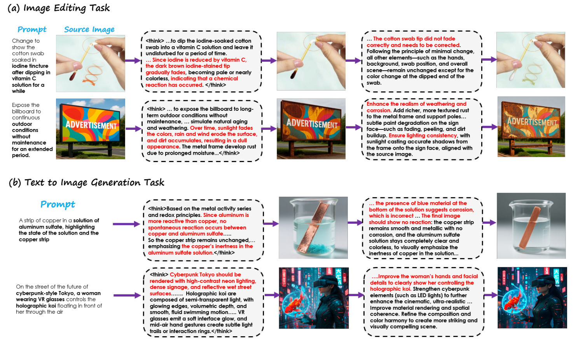
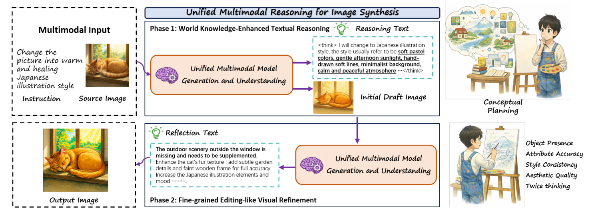
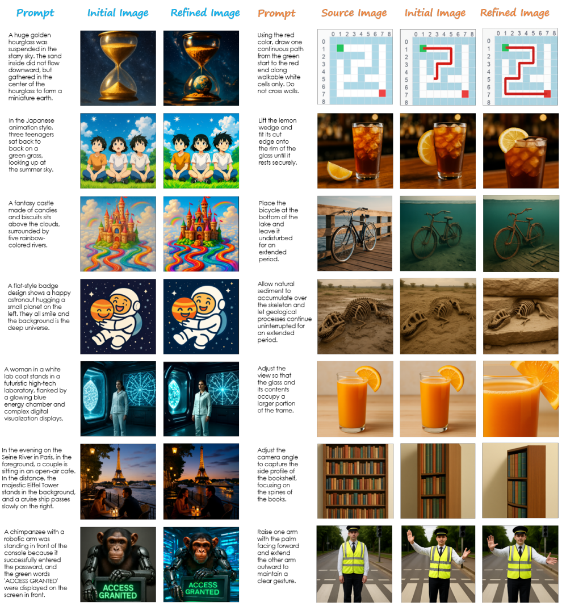

<p align="center">
  
</p>

<p align="center">
  <a href="https://arxiv.org/abs/2602.02437">
    
  </a>
  <a href="https://huggingface.co/Alex11556666/UniReason">
    
  </a>
  <a href="https://huggingface.co/datasets/Alex11556666/Reason_Tuning">
    
  </a>
</p>

# UniReason 1.0: A Unified Reasoning Framework for World Knowledge Aligned Image Generation and Editing
> [Dianyi Wang**](https://scholar.google.com/citations?hl=zh-CN&user=iP2HPFEAAAAJ), [Chaofan Ma**](https://github.com/chaofanma), [Feng Han](https://scholar.google.com/citations?user=oFmRTTkAAAAJ&hl=zh-CN), [Size Wu](https://wusize.github.io/), [Wei Song](https://scholar.google.com/citations?hl=zh-CN&user=k0blIUIAAAAJ), [Yibin Wang](https://codegoat24.github.io/), [Zhixiong Zhang](https://rookiexiong7.github.io/), Tianhang Wang, [Siyuan Wang :email:](https://siyuanwangw.github.io/), [Zhongyu Wei :email:](http://www.fudan-disc.com/people/zywei), [Jiaqi Wang :tophat: :email: ](https://myownskyw7.github.io/)
>
> contact: dywang24@m.fudan.edu.cn, sw_641@usc.edu, Wei-zywei@fudan.edu.cn, wjqdev@gmail.com

> We propose **UniReason**, a unified framework
that harmonizes these two tasks through a dual reasoning paradigm. We formulate generation
as world knowledge-enhanced planning to inject implicit constraints, and leverage editing capabilities
for fine-grained visual refinement to further correct visual errors via self-reflection. This approach
unifies generation and editing within a shared representation, mirroring the human cognitive process
of planning followed by refinement. We support this framework by systematically constructing a
large-scale reasoning-centric dataset covering five major knowledge domains (e.g.,
cultural commonsense, physics, etc.) for planning, alongside an agent-generated corpus for visual
self-correction. Extensive experiments demonstrate that UniReason achieves advanced performance
on reasoning-intensive benchmarks such as WISE and KrisBench, while maintaining superior general
synthesis capabilities on GenEval and ImgEdit. The figure below showcases UniReason's qualitative performance.

<p align="center"></p>


## 🧠 Method

Our core objective is to equip the unified multimodal model to infer implicit world knowledge underlying abstract instructions, and integrate world knowledge inference and surface-level organization into textual reasoning. This process provides explicit and structured guidance for synthesizing an initial visual output, mirroring human conceptual planning prior to rendering. The second complementary components is Fine-grained Editing-like Visual Refinement that re-assesses the initial synthesized image considering prior textual reasoning, reflectively identifies and verbalizes inconsistencies or missing details or incorporating a second round of textual reasoning to think twice, enabling iterative reflection and correction.


<p align="center"></p>

## 🔥 News
- **Feb 1, 2026:** We released **UniReason 1.0** stage_1(Foundational Generation Strengthening) and stage_2(Interleaved Reasoning Tuning) checkpoints on [Huggingface](https://huggingface.co/Alex11556666/UniReason), support both T2I generation and image editing with two complementary reasoning paradigms.
- **Feb 2, 2026:** We released the training and evaluation code support wide range of benchmarks 
- **Feb 3, 2026:** We released the **UniReason 1.0** technical report on [Arxiv](https://arxiv.org/abs/2602.02437)

## 🔥 Train & Eval

### Set up environment
```bash
git clone https://github.com/AlenjandroWang/UniReason.git
cd UniReason
conda create -n UniReason python=3.10 -y
conda activate UniReason
pip install -r requirements.txt
pip install flash_attn==2.5.8 --no-build-isolation
```

### Train
We provide the scripts for Interleaved Reasoning Tuning.
```bash
bash scripts/sft.sh
```

You can replace the variables in the script with your own before running. 
See [TRAIN](TRAIN.md) for more details.

### Eval
We provide the scripts for evaluating T2I and Editing benchmarks, support World Knowledge-Enhanced Textual Reasoning and Fine-grained Editing-like Visual Refinement. 
Please See [EVAL](EVAL.md) for more details.


## 📊 Benchmarks
### 1. Text-to-Image Generation
| Model        | Geneval ↑ |DPGBench ↑ |WISE ↑ |
| ------------ | --------- | --------- |--------- |
| BAGEL  | 0.88      |85.07|0.70|
| Hunyuan-Image-3.0  |  0.72     |86.10|0.57|
| Qwen-Image  | 0.74      |**88.32** |0.62|
| UniCoT    | 0.83  |- |0.75|
| **UniReason**    | **0.90**  |86.21|**0.78**|

### 2. Image Editing
| Model      |GEdit-EN ↑ |KrisBench ↑ |UniREditBench ↑ |
| ------------ | --------- | --------- |--------- |
| BAGEL  | 6.52      |60.18|50.96|
| Qwen-Image-Edit  | **7.56**      |-|56.52|
| LightFusion-World | 6.58      |61.85|-|
| UniCoT    | 6.74  |68.00|-|
| **UniReason**    | 6.94  |**68.23**|**70.06**|

## 🎨 Qualitative Results
<p align="center"></p>

## ✍️ Citation
```bibtex
@article{wang2026unireason,
  title={UniReason 1.0: A Unified Reasoning Framework for World Knowledge Aligned Image Generation and Editing},
  author={Wang, Dianyi and Ma, Chaofan and Han, Feng and Wu, Size and Song, Wei and Wang, Yibin and Zhang, Zhixiong and Wang, Tianhang and Wang, Siyuan and Wei, Zhongyu and others},
  journal={arXiv preprint arXiv:2602.02437},
  year={2026}
}
```

## 🙏 Acknowledgement
The project builds upon the following pioneering works:
- [BAGEL](https://github.com/ByteDance-Seed/Bagel): We thank the BAGEL team releasing the elegant and concise code and strong performance unified model.
- [BLIP3-o](https://github.com/JiuhaiChen/BLIP3o): We thank the BLIP3-o team for releasing the precious high-quality tuning dataset.
- [OpenGPT-4o-Image](https://arxiv.org/abs/2509.24900): We thank the OpenGPT-4o-Image team for releasing the precious high-quality tuning dataset.
- [ShareGPT-4o-Image](https://arxiv.org/abs/2506.18095): We thank the ShareGPT-4o-Image team for releasing the precious high-quality tuning dataset.
- [Echo-4o](https://arxiv.org/abs/2508.09987): We thank the Echo-4o team for releasing the precious high-quality tuning dataset.
- [Picobanana](https://github.com/apple/pico-banana-400k): We thank the Picobanana team for releasing the precious high-quality editing tuning dataset.
- [Nano-consist](https://huggingface.co/datasets/Yejy53/Nano-consistent-150k): We thank the Nano-consist team for releasing the precious high-quality editing tuning dataset.
- [UniREditBench](https://maplebb.github.io/UniREditBench/): We thank the UniREditBench team for releasing the precious high-quality reason-based editing tuning dataset.
